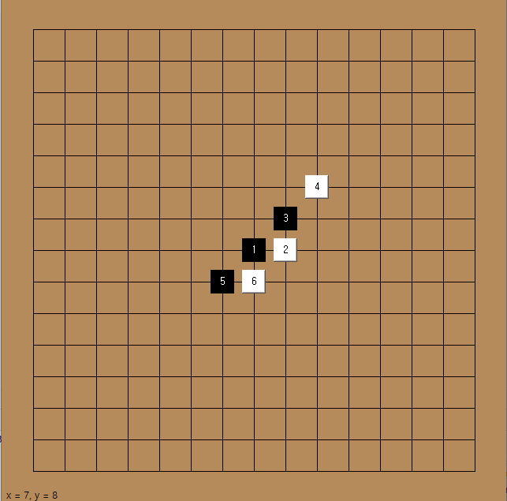
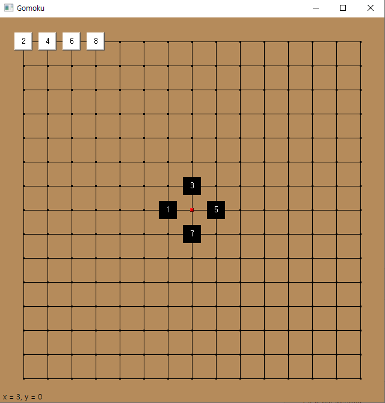
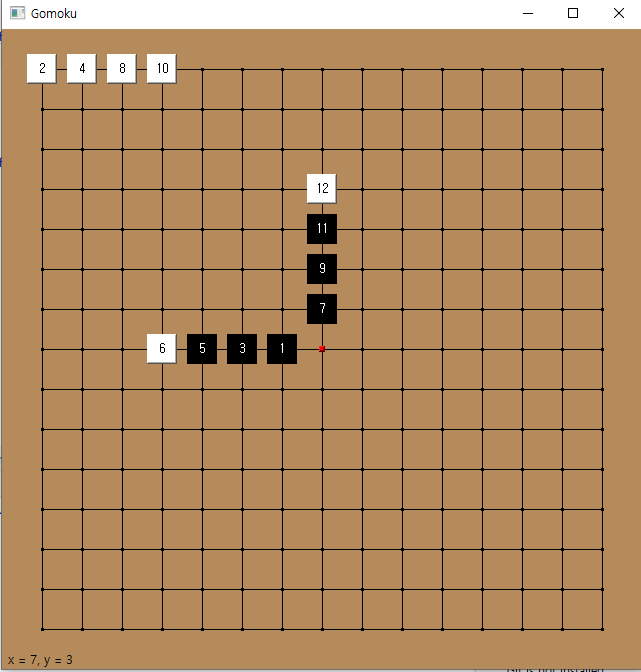
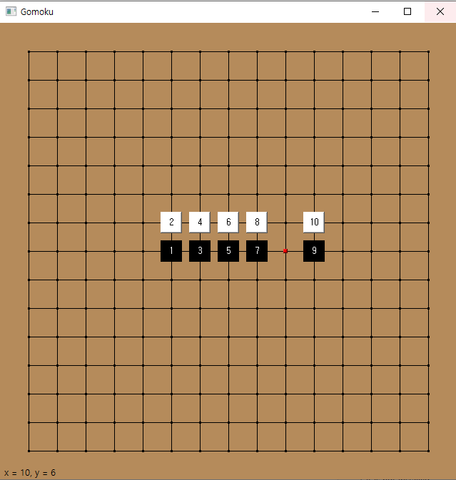

# renju-player

A gomoku program. Following picture shows the board of gomoku

In this game, there are two players. Each have its own stone color, black and white.

Starting with black player, the players alternate their turns by putting stones.

If any player puts five stones of same color in a row, one can win. The direction of the row can be vertical, horizontal, or diagonal.

<center>



Image of the program

</center>

# Rule (renju)

This program follows the renju rule.

Because of the advantage to the black player, some rules are added for equity.

1. Black cannot put stone at the place that makes two different lines with three non-blocked black stones.
2. Black cannot put stone at the place that makes two different lines with four black stones.
3. Black cannot put stone at the place that makes six or more consecutive black stones.
4. White can put stone at the place that makes six or more consecutive white stone.

If black violates rule 1,2,3, then black lose. If white follows rule 4, then white wins.

# Forbidden place

This program shows the forbidden place of the black stone described at the rule.

If the place is forbidden, the board shows red point.

<center>



double 3



double 4



6 in a row

</center>

# Requirements

```
pyqt == 5.9.2
```
